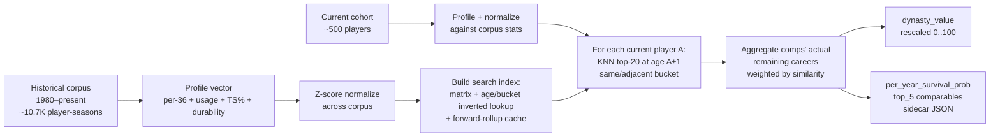

# Career-Arc Similarity Engine — Methodology

This document describes the technical machinery behind the
`career_arc` source. For the *why* and the model-level impact, see
`docs/CHANGELOG-model.md` v0.4.0.

---

## 1. Pipeline overview



## 2. Profile vector — 12 features

Order matters; the vector is positional. Defined in
`src/dynasty_bball/similarity/vectorize.py::FEATURE_NAMES`.

| # | Feature       | Definition                                        | Why it's here                    |
|---|---------------|---------------------------------------------------|----------------------------------|
| 0 | `pts_per36`   | `PTS × 36 / MIN`                                  | Scoring volume, pace-corrected   |
| 1 | `reb_per36`   | `REB × 36 / MIN`                                  | Frontcourt signal                |
| 2 | `ast_per36`   | `AST × 36 / MIN`                                  | Playmaking signal                |
| 3 | `stl_per36`   | `STL × 36 / MIN`                                  | Defensive disruption, DHK weight |
| 4 | `blk_per36`   | `BLK × 36 / MIN`                                  | Rim protection, DHK weight       |
| 5 | `tpm_per36`   | `FG3M × 36 / MIN`                                 | Floor spacing, scoring style     |
| 6 | `tov_per36`   | `TOV × 36 / MIN`                                  | Negative signal                  |
| 7 | `fga_per36`   | `FGA × 36 / MIN`                                  | Usage proxy                      |
| 8 | `fta_per36`   | `FTA × 36 / MIN`                                  | Rim pressure / FT-drawing        |
| 9 | `ts_pct`      | `PTS / (2 × (FGA + 0.44 × FTA))`                   | Efficiency, single-stat density  |
| 10 | `gp_pct`     | `min(1.0, GP/82)`                                  | Durability                       |
| 11 | `mpg`        | `MIN`                                              | Role / utilization               |

Per-36 (not per-game) so part-time role players in the historical
corpus aren't penalized purely for low minutes — we want stylistic
match, not playing-time accident. Durability (`gp_pct`, `mpg`) stays
in absolute terms because that's exactly the dimension where playing-
time *is* the signal.

### Normalization

After building the corpus, every feature is z-scored across the full
corpus:

```python
feature_means = raw_matrix.mean(axis=0)
feature_stds  = raw_matrix.std(axis=0)
normed = (raw - feature_means) / max(feature_stds, ε)
```

Means and stds are stored on `CorpusProfiles` and reused when
projecting current players (or future college prospects) into the
same space.

## 3. Position bucket — derived from stats

Historical box-score rows from `LeagueDashPlayerStats` don't carry
position. Rather than burn 20K extra API calls on `CommonPlayerInfo`
to label every player, we derive a play-style bucket from the
per-36 line:

```
big36  = (REB + 1.5 × BLK) × 36/MIN
ast36  = AST × 36/MIN

big36 ≥ 14 and ast36 < 3  → C
big36 ≥ 11 and ast36 < 4  → PF
ast36 ≥ 6.5               → PG
ast36 ≥ 4.0 and big36 < 8 → SG
big36 < 9                 → SF (default wing)
else                       → PF (combo big)
```

The buckets are used as a *soft* filter: same-bucket comps get
preferred (small `bucket_penalty=0.05` subtracted from adjacent-bucket
cosine), but adjacent buckets along the PG → SG → SF → PF → C axis are
still eligible. Misclassifications are fine — a wing labeled "PF"
just gets compared against PFs that year, and cosine similarity
surfaces his real comps inside the bucket.

## 4. KNN comparables

For each current player P at age A:

1. **Eligibility filter.** Candidates must have age within
   `A ± age_window` (default 1.0), be in P's bucket or an adjacent
   one, and have at least one season *after* their candidate season
   in the corpus (otherwise "remaining career" is undefined).
2. **Cosine similarity.** Computed as a single matmul against the
   precomputed normalized matrix (`search_index.norm_matrix`),
   indexed into via `(age_bin, position_bucket)` precomputed lookup.
3. **Bucket penalty.** `sim -= 0.05` for adjacent-bucket matches.
   Same-bucket matches always preferred when available.
4. **Top-K.** Default K=20. The full list flows into projection;
   the top-5 flow into the sidecar JSON for UI display.

Cost: with the search index pre-built, each player's KNN is one
matmul over ~200–500 candidates. Total cohort run: 30–40s for ~500
players + 10.7K corpus rows on a modest dev box.

## 5. Projection

Inputs per comp: similarity, `remaining_seasons`, `remaining_games`,
`remaining_fantasy_ppg_{dhk,default}`, `ages_after`, `censored`.

### Aggregation rules

- **Similarity weights.** `w_i = sim_i / Σ sim_i` (negative sims
  clipped, but they shouldn't occur post-sigmoid-shift).
- **`projected_remaining_years`** — weighted **median** of
  `remaining_seasons`. The distribution is bimodal (early-retirement
  vs long-career); median is robust against the tail. Floor at 1.0
  (every current player gets credit for at least one more season).
- **`projected_total_fantasy_points`** — weighted **mean** of each
  comp's present-value remaining points:
  ```
  pv(comp) = ppg × (games / remaining_seasons) × Σ_{y=1..remaining_seasons} (1 + 0.05)^-y
  ```
  Spreads each comp's remaining games evenly across remaining seasons
  and discounts each season at 5%/yr (Dynasty-Football-Model's
  draft-pick discount rate).
- **`per_year_survival_prob[k]`** — fraction of comps (similarity-
  weighted) still playing at age `A+k`, for k=1..15. Surfaced for
  diagnostic purposes; not currently part of the headline score.
- **`dynasty_value`** = `projected_total_fantasy_points` rescaled
  0..100 across the cohort (top player = 100).

### Why median for years and mean for points?

The remaining-years distribution is bimodal because some careers end
abruptly (knee surgery at 25, retirement at 30) and some persist into
the late 30s. The median ignores the tail — which is the right call
because the tail is dominated by survivor bias (the players we observe
at 38 are the ones who didn't blow up; an unobserved comp who would
have played to 38 but got injured at 30 is invisible to us).

Per-season fantasy points are normally distributed around the
player's skill level — mean is the right estimator.

## 6. Two-format emission

Comps are computed once per player (they're profile-based, format-
independent), then projected twice — once per league_format. The two
formats diverge because each comp's `remaining_fantasy_ppg` is
computed using `scoring.LEAGUE_SCORING[format]`:

- DHK: pts=0.5, reb=1.0, ast=1.0, stl=2.0, blk=2.0, tpm=0.5,
  to=-1.0, dd=1.0, td=2.0, …
- default: pts=1.0, reb=1.2, ast=1.5, stl=3.0, blk=3.0, tpm=0.5,
  to=-1.0

For example: a Tony Allen / Andre Iguodala-style high-steal/high-
defense wing's remaining career ppg is markedly higher in DHK than
in default (lower scoring penalty, higher stocks weight). That gets
baked into the dynasty_value for any current player whose comp pool
leans defensive.

## 7. Performance

The pipeline is designed to fit the existing CI budget (no live API
calls per build):

- **Historical corpus** is committed (`data/historical_nba/league_*.json`,
  4 MB compressed JSON). 45 seasons × ~500 players.
- **Current-season production** is reused from the basketball_reference
  cache (already committed).
- **Search index** is built once per `build_projections()` call.
  Includes the forward-rollup cache (memoized
  `(nba_id, rounded_age) → rollup_dict`).
- **Memory:** ~10 MB for the corpus and search index.
- **Wall time on a 2-core CI runner:** ~40s for KNN + projection
  over the full cohort.

To refresh the historical corpus, run
`python scripts/backfill_historical_nba.py` locally (one-shot, ~75s
with the default 0.6s inter-request delay), then commit the cache
files. CI itself never touches stats.nba.com for historical data.

## 8. Forward extensions (PR #5)

The similarity layer is parameterized to accept arbitrary corpora.
PR #5 will add:

- `similarity.vectorize.vectorize_college_season` — translate
  college per-game stats to the NBA-scale 12-dim profile vector,
  accounting for pace (~70 → ~100 possessions) and league strength
  (P5 vs G5 vs international).
- A college → NBA bridge corpus, built by joining sports-reference
  college stats to `nba_api`'s `CommonAllPlayers` to link each
  prospect's college career to his eventual NBA career.
- `comparables.find_comparables(...)` is already parameterized so
  the same code path will produce college → NBA comps without
  modification, after the college vectorizer lands.

The TODO marker is in `vectorize.py` at the
`vectorize_college_season` stub.
